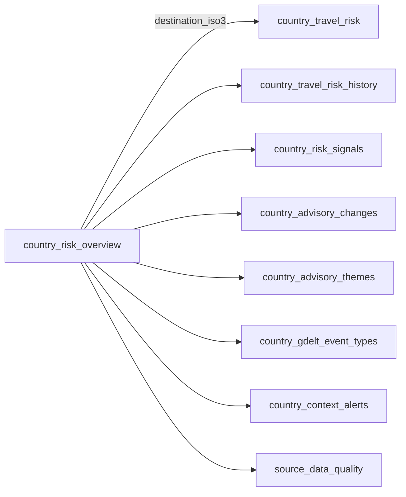

# Analysts

Use this hub when you want to query TravelCanary data, not operate it.
TravelCanary ships software and local warehouse tooling, not a hosted dataset
or travel recommendation.

## Do You Already Have A Warehouse?

=== "Yes — open and query"

    Open the DuckDB file produced by a local or demo run:

    ```bash
    duckdb travelcanary.duckdb
    ```

    The default path is `travelcanary.duckdb` in the repository root. Demo
    warehouses live at `.cache/travelcanary_demo.duckdb`. If `.env` sets
    `DUCKDB_PATH`, open that file instead. Prefer
    `duckdb.connect(..., read_only=True)` in notebooks so you do not compete
    with a writer.

    Continue with [Query the warehouse](../guides/query-the-warehouse.md).

=== "No — need a run first"

    Ask an operator to complete [Quickstart](../getting-started/index.md) or
    build the offline demo with `uv run make demo`, then return here. Analysts
    do not need Dagster schedules for ordinary mart queries.

## Join Map



Practical join rules:

- Prefer `destination_iso3` as the country key across public marts.
- Overview health fields are pipeline usability signals, not destination safety.
- Inspect native labels and `source_url` before interpreting normalized ordinals.

## Next Pages

| Goal | Page |
| --- | --- |
| Shortest query path and table chooser | [Query the warehouse](../guides/query-the-warehouse.md) |
| Copy-paste SQL | [Query recipes](../guides/query-recipes.md) |
| Grain, filters, and common mistakes | [Data dictionary](../reference/data-dictionary.md) |
| Formal contract guarantees | [Data contracts](../reference/data-contracts.md) |
| Term definitions | [Glossary](../concepts/glossary.md) |
