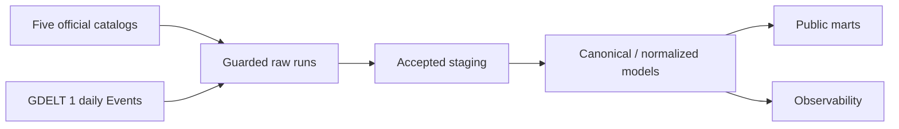
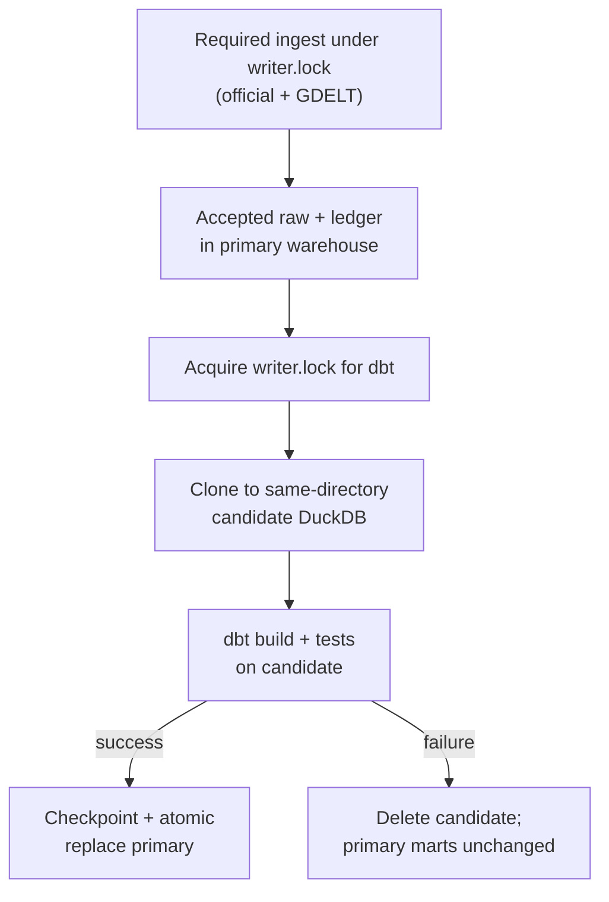

# Architecture

TravelCanary uses one operator-controlled local DuckDB warehouse. Required
ingestion completes before dbt advances public marts.

## Publication boundary

Ingest writers, history import, and dbt share one fail-fast sibling
`writer.lock`. dbt never mutates the primary file in place: it clones to a
same-directory candidate, builds and tests there, then promotes only on full
success. A candidate failure deletes the candidate and leaves accepted raw plus
the previously published marts in the primary warehouse.

## Layers

1. **Fetch and parse.** Each attempt gets a UUID `source_run_id`. Official
   adapters parse complete catalogs; GDELT parses the exact GDELT 1 daily
   schema.
2. **Guard.** Python reads `dbt/seeds/source_contracts.csv`, evaluates row
   count and coverage, and validates official `advisory_id` uniqueness before
   landing. Rejected GDELT writes are rolled back before their outcome is
   recorded.
3. **Land and finalize.** Official dlt resources append a complete candidate
   batch. A DuckDB transaction then records acceptance and deletes every
   superseded raw run together. GDELT streams its ZIP member through a
   disk-backed CSV stage and performs one native `INSERT OR REPLACE ... SELECT
   FROM read_csv` upsert inside the same accept/reject transaction, then
   prunes its rolling window and records acceptance. Writable DuckDB sessions
   disable `preserve_insertion_order`; optional `DUCKDB_MEMORY_LIMIT` caps
   session memory.
4. **Select accepted data.** Official staging selects the latest accepted
   catalog. GDELT staging selects every accepted retained daily run so
   seven-day windows remain complete.
5. **Transform.** dbt clones the checkpointed warehouse to a same-directory
   candidate, resolves ISO identities, normalizes levels, aggregates GDELT by
   country/day, and builds and tests marts there.
6. **Publish.** A successful dbt build checkpoints and atomically replaces the
   primary DuckDB file. A failed build deletes the candidate, leaving accepted
   raw and ledger state in the primary file while preserving its previously
   published marts.

See [Orchestration](../reference/orchestration.md) for jobs, schedules, and
writer locking. See [System overview](system-overview.md) for product
boundaries.
